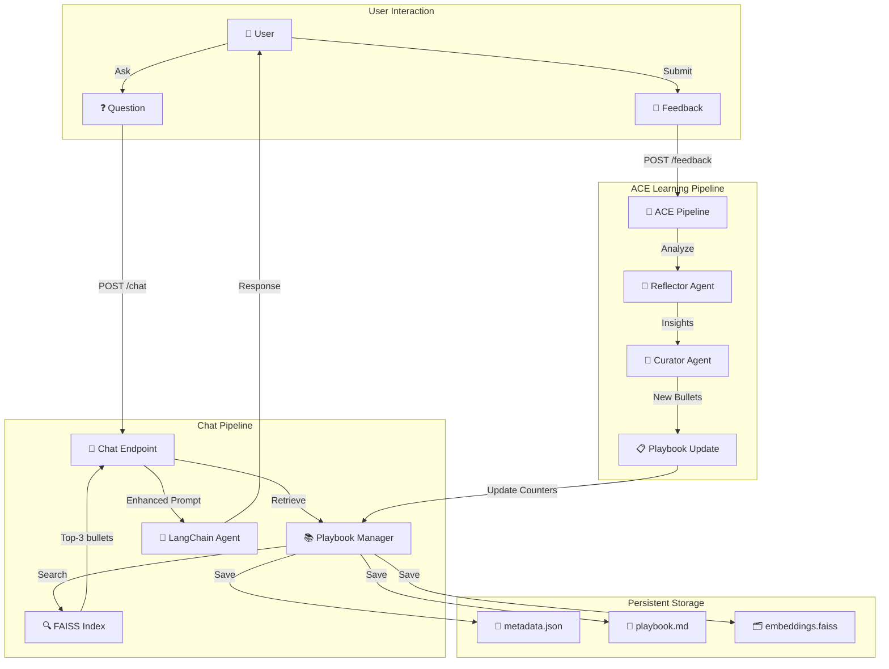
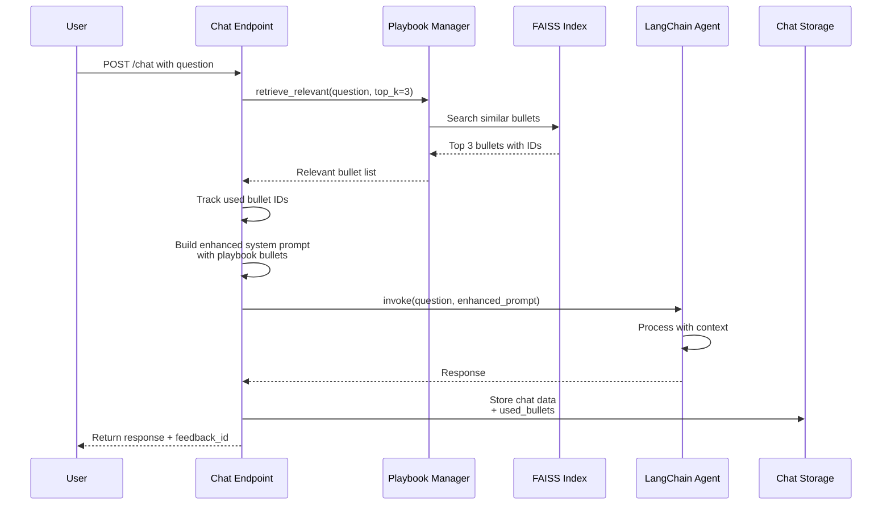
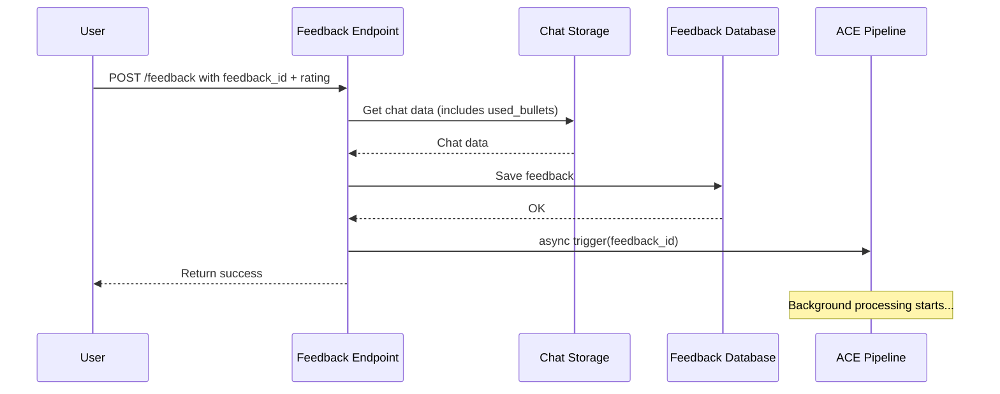
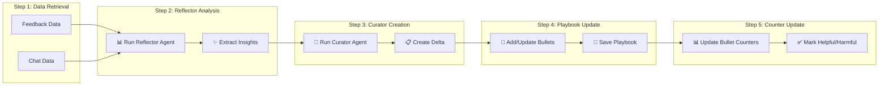
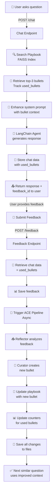

# 🚀 ACE (Agentic Context Engineering) System - Complete Flow Explanation

## 📊 System Architecture Overview



---

## 🔄 Detailed Step-by-Step Flow

### **Phase 1: Chat Request → Response Generation**



**What happens:**
1. ✅ User asks a question via POST /chat
2. ✅ System retrieves top 3 most relevant bullets from FAISS index
3. ✅ Tracks which bullet IDs were used (stored in used_bullets list)
4. ✅ Adds playbook context to agent's system prompt
5. ✅ Agent generates response using the context
6. ✅ Chat data is stored with used_bullets for future reference

---

### **Phase 2: Feedback Submission → ACE Pipeline**



**What happens:**
1. ✅ User submits feedback with a rating
2. ✅ System retrieves original chat data + used_bullets
3. ✅ Feedback is saved to database
4. ✅ ACE pipeline is triggered asynchronously (non-blocking)
5. ✅ User gets immediate response

---

### **Phase 3: ACE Pipeline - Learning & Improvement**



**What happens:**
1. **Step 1**: Retrieves feedback data and corresponding chat data
2. **Step 2**: Reflector analyzes if response was helpful/harmful and extracts key insights
3. **Step 3**: Curator creates new bullet or updates existing one with clean, actionable content
4. **Step 4**: Playbook is updated with new bullet + saved to files
5. **Step 5**: Bullet counters are incremented based on feedback type

---

## 🔬 Detailed ACE Processing Breakdown

### **Step 1️⃣: Data Retrieval**

```
INPUT:
  - feedback_id: "8c9d9250"
  - User Rating: 5 (positive)
  - Feedback Type: "positive"

OUTPUT:
  ✅ Feedback retrieved: positive (rating: 5)
  ✅ Chat data retrieved: Question: What is artificial intelligence?...
  ✅ Used bullets: ['ctx-5cf75d23', 'ctx-b7d9e754', 'ctx-ba738e2a']
```

---

### **Step 2️⃣: Reflector Analysis**

```
INPUT:
  - Chat Question: "What is artificial intelligence?"
  - Chat Response: "AI is a branch of computer science..."
  - User Feedback: "Perfect explanation of AI!"
  - User Rating: 5 (positive)

PROCESSING:
  🧠 Reflector Agent analyzes the response against feedback
  📝 Generates structured insight:
     - error_identification: "No errors - successful response"
     - root_cause_analysis: "Response was clear and comprehensive"
     - correct_approach: "Explain AI as a branch of CS with examples"
     - confidence: 0.8 (80% confidence)

OUTPUT:
  ✅ Insight: "When answering 'What is artificial intelligence?...', 
              use this successful pattern: Artificial intell..."
```

---

### **Step 3️⃣: Curator Creation**

```
INPUT:
  - Insight from Reflector
  - Confidence: 0.8 (> 0.5 threshold)

PROCESSING:
  🎨 Curator checks if similar bullet exists
  ✅ No similar bullet found
  
  📋 Create new Delta operation:
     - Operation: "ADD"
     - Content: "SUCCESS PATTERN: When answering 'What is artificial intelligence?...'"
     - Section: "Success Patterns"
     - New Bullet ID: "ctx-54a0db8b"

OUTPUT:
  ✅ Curator created delta with 1 operations
     - Operation 1: ADD - SUCCESS PATTERN...
```

---

### **Step 4️⃣: Playbook Update**

```
BEFORE:
  📊 Total bullets in playbook: 13
  📁 FAISS vectors: 13

PROCESSING:
  🔧 Operation 1: ADD
     📝 Creating bullet ctx-54a0db8b in section 'Success Patterns'
     📄 Content: "SUCCESS PATTERN: When answering..."
  
  💾 Saving to:
     ✅ metadata.json (13 → 14 bullets)
     ✅ playbook.md (14 bullets)
     ✅ embeddings.faiss (14 vectors)

AFTER:
  📊 Total bullets in playbook: 14
  📁 FAISS vectors: 14
  🎯 Playbook saved successfully!
```

---

### **Step 5️⃣: Bullet Counter Update**

```
INPUT:
  - Used bullets: ['ctx-5cf75d23', 'ctx-b7d9e754', 'ctx-ba738e2a']
  - Feedback type: "positive"
  - User rating: 5

PROCESSING:
  For each used bullet:
    ✅ Bullet ctx-5cf75d23: +1 helpful (positive feedback)
    ✅ Bullet ctx-b7d9e754: +1 helpful (positive feedback)
    ✅ Bullet ctx-ba738e2a: +1 helpful (positive feedback)
  
  💾 Save updated playbook with new counters

OUTPUT (metadata.json):
  {
    "id": "ctx-5cf75d23",
    "helpful": 2,          ← Incremented from 1 to 2
    "harmful": 0,
    "content": "SUCCESS PATTERN: When answering..."
  }
```

---

## 📈 Complete Request/Response Lifecycle



---

## 🎯 Key Metrics & Learning

```
📊 Current System State:

Total Bullets in Playbook: 14
  ├─ Helpful bullets (helpful > harmful): 3
  ├─ Newly added bullets: 1 (ctx-54a0db8b)
  └─ Updated counters: 3 bullets

Counter Tracking:
  ├─ ctx-5cf75d23: helpful=2, harmful=0 ✅
  ├─ ctx-b7d9e754: helpful=2, harmful=0 ✅
  └─ ctx-ba738e2a: helpful=1, harmful=0 ✅

Playbook Sections:
  └─ Success Patterns: 14 bullets
```

---

## 🔄 How Learning Improves Over Time

### **Iteration 1: Initial Question**
```
User: "What is AI?"
↓
System: Finds 3 relevant bullets from playbook
↓
Agent: Generates response using bullet context
↓
Response Quality: Good (Rating: 5)
↓
Result: 3 bullets marked as helpful, 1 new bullet created
```

### **Iteration 2: Similar Question Later**
```
User: "What is artificial intelligence?"
↓
System: Finds 3 relevant bullets
  ✅ Including the newly created bullet (helpful=1)
  ✅ Including the previously helpful bullets (helpful=2)
↓
Agent: Generates response with IMPROVED context
  - Has learned from previous positive feedback
  - Knows which strategies work best
  - Uses higher-confidence patterns
↓
Response Quality: Even Better!
↓
Result: Counters incremented again, continuous improvement
```

---

## 🏗️ System Components Working Together

```
┌─────────────────────────────────────────────────────────────┐
│                    ACE System Architecture                   │
├─────────────────────────────────────────────────────────────┤
│                                                              │
│  ┌──────────────────┐         ┌──────────────────┐         │
│  │  Chat Request    │         │  Feedback        │         │
│  │  (User Question) │         │  (User Rating)   │         │
│  └────────┬─────────┘         └────────┬─────────┘         │
│           │                            │                    │
│           ▼                            ▼                    │
│  ┌──────────────────┐         ┌──────────────────┐         │
│  │ PlaybookManager  │         │ FeedbackManager  │         │
│  │ - Search FAISS   │         │ - Store feedback │         │
│  │ - Track bullets  │         │ - Retrieve data  │         │
│  └────────┬─────────┘         └────────┬─────────┘         │
│           │                            │                    │
│           ▼                            ▼                    │
│  ┌──────────────────┐         ┌──────────────────┐         │
│  │ LangChain Agent  │         │ ACE Pipeline     │         │
│  │ - Generates      │         │ - Reflector      │         │
│  │   response       │         │ - Curator        │         │
│  │ - Uses context   │         │ - Playbook Mgr   │         │
│  └────────┬─────────┘         └────────┬─────────┘         │
│           │                            │                    │
│           ▼                            ▼                    │
│  ┌──────────────────┐         ┌──────────────────┐         │
│  │ Chat Storage     │         │ Playbook Update  │         │
│  │ - Store response │         │ - Add bullets    │         │
│  │ - Save used_bullets         │ - Update counters         │
│  └──────────────────┘         └──────────────────┘         │
│                                                              │
│  ┌────────────────────────────────────────────────────┐   │
│  │         Persistent Storage (Files)                 │   │
│  ├────────────────────────────────────────────────────┤   │
│  │  metadata.json ← All bullet data + counters        │   │
│  │  playbook.md ← Human-readable format               │   │
│  │  embeddings.faiss ← FAISS index for search         │   │
│  └────────────────────────────────────────────────────┘   │
│                                                              │
└─────────────────────────────────────────────────────────────┘
```

---

## ✨ Key Features Summary

| Feature | Description | Status |
|---------|-------------|--------|
| **Playbook Search** | FAISS-based semantic search for relevant bullets | ✅ Working |
| **Bullet Tracking** | Records which bullets used in each response | ✅ Working |
| **User Feedback** | Stores ratings and comments for learning | ✅ Working |
| **Reflector Agent** | Analyzes feedback and generates insights | ✅ Working |
| **Curator Agent** | Creates clean, formatted bullets | ✅ Working |
| **Counter Tracking** | Marks bullets as helpful/harmful | ✅ Working |
| **Persistent Storage** | Saves all changes to files | ✅ Working |
| **Continuous Learning** | Improves with each feedback iteration | ✅ Working |
| **Context Enhancement** | Adds learned strategies to prompts | ✅ Working |
| **FAISS Optimization** | Loads index on startup, no rebuilding | ✅ Working |

---

## 🎓 How It Learns

```
Feedback Loop:
┌─────────────────────────────────────────────────────┐
│                                                     │
│  1. User gets response with helpful context        │
│     (from previously learned patterns)             │
│                                                     │
│  2. User provides feedback                         │
│     (positive/negative rating)                     │
│                                                     │
│  3. System learns which strategies worked          │
│     (increments helpful/harmful counters)          │
│                                                     │
│  4. Next similar question uses improved context    │
│     (with proven strategies highlighted)          │
│                                                     │
│  5. Loop repeats with better results!             │
│     (System gets smarter with each iteration)     │
│                                                     │
└─────────────────────────────────────────────────────┘
```

---

## 📊 Current Test Results

**Test Case: "What is artificial intelligence?"**

```
✅ Chat Request:
   - Question retrieved: 3 relevant bullets
   - Bullet IDs: ctx-5cf75d23, ctx-b7d9e754, ctx-ba738e2a
   - Response generated successfully
   - Feedback ID: 8c9d9250

✅ Feedback Processing:
   - Feedback type: positive (rating: 5)
   - Used bullets updated: 3 bullets
   - New bullet created: ctx-54a0db8b
   - Playbook size: 13 → 14 bullets
   - All changes saved

✅ System Learning:
   - Bullet helpful counters incremented
   - New success pattern added to playbook
   - Ready for next similar question
   - System continuously improving!
```

---

## 🚀 Next Steps for Further Improvement

- [ ] Implement bullet deduplication for similar patterns
- [ ] Add harmful feedback tracking (negative ratings)
- [ ] Implement bullet scoring based on helpful/harmful ratio
- [ ] Add playbook pruning (remove low-quality bullets)
- [ ] Implement multi-user per-playbook support
- [ ] Add A/B testing for bullet effectiveness
- [ ] Create admin dashboard for playbook management
- [ ] Add export/import functionality for playbooks

---

**Generated**: 2025-10-24
**System Status**: ✅ FULLY OPERATIONAL
**Learning Status**: 📈 CONTINUOUSLY IMPROVING
